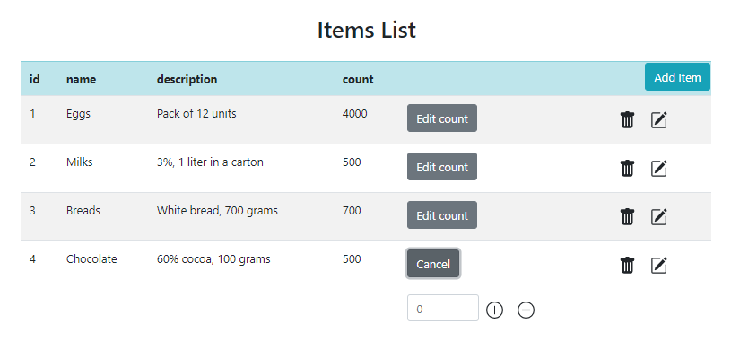

# inventory-management

Inventory Management application
The application allows the viewing and managing of a list of items (sorted by id)  in an inventory.

It allows simple actions to be performed, such as:

* add item
* update iem
* delete item
* deposit - by change item count  ('+' icon)
* withdrawal - by change item count ('-' icon)

 
<kbd></kbd>
